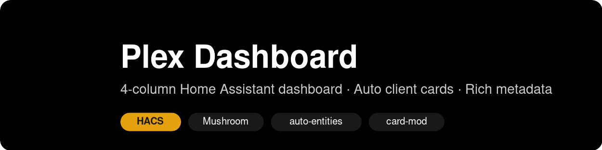

# Plex Dashboard for Home Assistant



[](https://github.com/hacs/integration)


A polished 4-column **Plex dashboard** for Home Assistant with rich
now-playing metadata, automatic per-client cards, server stats, recently
added posters, and Sonarr/Radarr coming-soon — installed as a single
HACS **integration** that does all the file-copy, helper-creation, and
dashboard-registration work for you.

---

## Features

- **4-column responsive layout** (HA `sections` view)
- **Auto now-playing cards** – one rich card per active stream, no manual YAML
- **Rich metadata** – poster, title, S/E or artist/album, user, state, progress
- **Server overview** – status, stream chips, bandwidth bar, action buttons
- **Library counts** – auto-discovered from `sensor.plex_library_*`
- **Client list** – every Plex client (active + idle), sorted by activity
- **Recently added** – Movies / TV / Music with a filter pill
- **Coming soon view** – Radarr + Sonarr upcoming releases
- **Plex amber dark theme** – bundled and auto-installed

---

## Requirements

- Home Assistant 2024.1 or newer
- [HACS](https://hacs.xyz) installed
- The official **Plex Media Server** integration set up
  (provides the `sensor.plex_*` and `media_player.plex_*` entities)
- `homeassistant.packages:` enabled in your `configuration.yaml`:
  ```yaml
  homeassistant:
    packages: !include_dir_named packages
  ```
  (the integration will raise a Repair if this is missing)

### Frontend cards (HACS Frontend)

Only **four** custom cards are required. Click each badge to open it
directly in HACS (one-click install), then reload your browser. Any
missing card will also be surfaced as a single Repair after install.

| Card | One-click install |
| --- | --- |
| Auto-entities | [](https://my.home-assistant.io/redirect/hacs_repository/?owner=thomasloven&repository=lovelace-auto-entities&category=plugin) |
| Button card | [](https://my.home-assistant.io/redirect/hacs_repository/?owner=custom-cards&repository=button-card&category=plugin) |
| Mini media player | [](https://my.home-assistant.io/redirect/hacs_repository/?owner=kalkih&repository=mini-media-player&category=plugin) |
| Upcoming media card | [](https://my.home-assistant.io/redirect/hacs_repository/?owner=custom-cards&repository=upcoming-media-card&category=plugin) |

> Built-in `gauge`, `tile`, `markdown`, and `entities` cards now replace
> the previous `mushroom-*` and `bar-card` dependencies.

---

## Installation

### Step 1 — Add the repository to HACS

[](https://my.home-assistant.io/redirect/hacs_repository/?owner=kitwalker14&repository=HA_PLEX_DASHBOARD&category=integration)

Or manually: **HACS → ⋮ → Custom repositories**, paste
`https://github.com/kitwalker14/HA_PLEX_DASHBOARD`, type **Integration**,
**Add**, then **Download**.

### Step 2 — Restart Home Assistant

### Step 3 — Add the integration

**Settings → Devices & Services → Add Integration → "Plex Dashboard"**.

Pick your Plex server slug from the dropdown (auto-detected from your
existing `sensor.plex_*` entities) and submit.

### Step 4 — Restart Home Assistant once more

The integration will copy:

- `plex-dashboard.yaml` → `/config/themes/`
- `plex_dashboard_package.yaml` → `/config/packages/`
- `plex_dashboard_dashboard.yaml` → `/config/dashboards/`

…create the helpers (`input_boolean.plex_show_paused`,
`input_boolean.plex_show_offline_clients`,
`input_select.plex_recently_added_filter`), and register the
**Plex Dashboard** entry in the Lovelace sidebar.

After the second restart, your new dashboard is in the sidebar — done.

---

## Updating

Update via HACS like any other integration; new versions will refresh the
bundled YAML on the next reload of the integration entry.

---

## Uninstalling

**Settings → Devices & Services → Plex Dashboard → Delete**, then remove
the integration via HACS. The copied YAML files in `themes/`, `packages/`,
and `dashboards/` are left in place so you can keep customising them.

---

## Development

See [`CONTRIBUTING.md`](CONTRIBUTING.md).

## License

[MIT](LICENSE)
