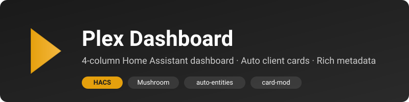

# Plex Dashboard for Home Assistant



[](https://github.com/hacs/integration)


A polished 4-column **Plex dashboard** for Home Assistant with rich
now-playing metadata, automatic per-client cards, server stats, recently
added posters, and Sonarr/Radarr coming-soon — plus a matching Plex amber
**HACS theme**.

---

## Why two install steps?

HACS does not have a category for distributing dashboard YAML or package YAML
— only `.js` plugins, integrations, themes, etc. So this repo ships:

| Component | Delivery |
| --- | --- |
| **Plex Dark theme** | HACS Theme (one click) |
| **Dashboard YAML + package YAML** | GitHub Release zip + one-line installer script |

Both updates flow through the same repo + release tags.

---

## Features

- **4-column responsive layout** (HA `sections` view)
- **Auto now-playing cards** – one rich card per active stream, no manual YAML
- **Rich metadata** – poster, title, S/E or artist/album, user, state, progress
- **Server overview** – status, stream chips, bandwidth bar, action buttons
- **Library counts** – auto-discovered from `sensor.plex_library_*`
- **Client list** – every Plex client (active + idle), sorted by activity
- **Recently added** – Movies / TV / Music with a filter pill
- **Coming soon view** – Radarr + Sonarr upcoming releases
- **Plex amber dark theme** (HACS-installable)

---

## Installation

### Step 1 — Install the theme via HACS

1. **HACS → ⋮ menu → Custom repositories**
2. Repository: `https://github.com/kitwalker14/HA_PLEX_DASHBOARD`
3. Type: **Theme**
4. Click **Add**, then find **"Plex Dashboard"** in HACS Themes → **Download**

(Once this repo is added to the HACS default themes index, the custom-repo
step won't be needed — users will find it directly in the HACS Theme
catalogue.)

### Step 2 — Install the dashboard files

#### Option A — installer script (recommended)

```sh
curl -L https://github.com/kitwalker14/HA_PLEX_DASHBOARD/releases/latest/download/plex_dashboard_extras.zip -o /tmp/pd.zip
unzip -o /tmp/pd.zip -d /tmp/pd
HA_CONFIG=/config /tmp/pd/scripts/install.sh
```

#### Option B — manual

1. Download `plex_dashboard_extras.zip` from the
   [latest Release](https://github.com/kitwalker14/HA_PLEX_DASHBOARD/releases/latest)
2. Extract and copy:
   - `extras/packages/plex_dashboard.yaml` → `/config/packages/`
   - `extras/dashboards/plex_dashboard.yaml` → `/config/dashboards/`

### Step 3 — Install the required HACS frontend cards

| Card | Repo |
| --- | --- |
| Mushroom | `piitaya/lovelace-mushroom` |
| Button card | `custom-cards/button-card` |
| Mini media player | `kalkih/mini-media-player` |
| Bar card | `custom-cards/bar-card` |
| Auto-entities | `thomasloven/lovelace-auto-entities` |
| Card-mod | `thomasloven/lovelace-card-mod` |
| Upcoming media card | `custom-cards/upcoming-media-card` |

### Step 4 — Wire it into `configuration.yaml`

```yaml
homeassistant:
  packages: !include_dir_named packages

lovelace:
  mode: storage
  dashboards:
    plex-dashboard:
      mode: yaml
      title: Plex
      icon: mdi:plex
      show_in_sidebar: true
      filename: dashboards/plex_dashboard.yaml
```

### Step 5 — Required HA integrations

- **Plex** (official) – `media_player.plex_*`, `sensor.plex_*`
- **Plex Recently Added** (custom_component) – `sensor.plex_recently_added_*`
- **Radarr / Sonarr** (official) – Coming Soon view (optional)
- **Tautulli** (official) – total bandwidth (optional)

### Step 6 — Replace placeholders

In `/config/packages/plex_dashboard.yaml` find/replace:

| Placeholder | Replace with |
| --- | --- |
| `PLEX_SERVER_NAME` | Your Plex slug from `sensor.plex_<slug>` |

### Step 7 — Restart & activate

Restart HA, then **Profile → Theme → "Plex Dark"**.

---

## Updating

- **Theme** – HACS will show an update badge; click Update
- **Dashboard** – re-run the installer command from Step 2A; it overwrites
  the two YAML files in place. Your `configuration.yaml` includes don't
  change.

---

## Repository layout

```text
.
├── hacs.json                                 # HACS theme manifest
├── themes/
│   └── plex-dashboard.yaml                   # ← what HACS installs
├── extras/                                   # ← what the release zip ships
│   ├── packages/plex_dashboard.yaml          #   template sensors, scripts
│   └── dashboards/plex_dashboard.yaml        #   the dashboard
├── scripts/install.sh                        # bundled installer
├── .github/workflows/
│   ├── validate.yml                          # HACS Action + yamllint
│   └── release.yml                           # builds extras zip on tag push
├── CHANGELOG.md
├── CONTRIBUTING.md
├── LICENSE
└── README.md
```

---

## What the package adds

| Entity | Description |
| --- | --- |
| `sensor.plex_active_streams` | Total + `playing/paused/buffering` attrs |
| `sensor.plex_active_client_ids` | Active `media_player.plex_*` ids list |
| `sensor.plex_total_bandwidth_mbps` | From Tautulli (0 if absent) |
| `sensor.plex_server_online` | `on`/`off` |
| `binary_sensor.plex_anything_playing` | `on` if any stream active |
| `script.plex_scan_all_libraries` | Scan all libraries |
| `script.plex_pause_all` | Pause all active streams |
| `input_boolean.plex_show_paused` | Dashboard toggle |
| `input_boolean.plex_show_offline_clients` | Dashboard toggle |
| `input_select.plex_recently_added_filter` | All / Movies / TV / Music |

---

## Troubleshooting

| Symptom | Fix |
| --- | --- |
| Theme not in HACS list | Make sure you added the repo as type **Theme** |
| `Custom element doesn't exist: custom:mushroom-...` | Install the card via HACS, hard-refresh browser |
| `sensor.plex_PLEX_SERVER_NAME` is `unavailable` | Replace the placeholder with your slug |
| Now Playing column empty while streaming | Adjust the `media_player.plex_*` regex if your client entities don't match |
| Recently added cards blank | Install **Plex Recently Added** custom component |
| Coming Soon cards blank | Set up Radarr / Sonarr |

---

## License

[MIT](LICENSE)
